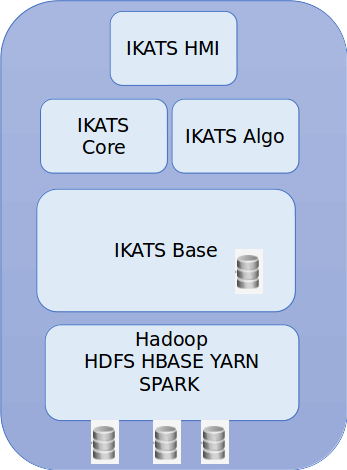

 Overview of IKATS Architecture
=============

This page introduces an overview of the IKATS's architecture

Here below is the global layer of IKATS.

* IKATS HMI is the graphical user interface, in javascript, that provides a web-based access to IKATS features.
* IKATS CORE manages access to the python algorithms catalog and provides an engine to run them from HMI
* IKATS Algo is the library of IKATS algorithms developed in python (with its own connector to time series database for more efficiency)
* IKATS Base provides an access to IKATS resources stored either in PostgreSQL database (for non temporal data) or in Open TSDB database (for temporal data) through an HTTP API
* SPARK allows  computing to be distributed over cluster nodes
* Hadoop/HDFS/HBASE provides a distributed filesystem over a cluster with data replication

Big data infrastructure
-------

IKATS is designed in a **microservices architecture**, which means that it is composed of many different and independent services, communicating via HTTP.
This approach improves modularity and makes the application easier to understand, develop, test, and more resilient.
Orchestrated by [kubernetes](https://kubernetes.io/), the application is more fault-tolerant, as this one can restart any container when its failure is detected. Service interruption is then minimized.

IKATS can be installed on a standalone PC ([IKATS Sandbox](https://github.com/IKATS/ikats-sandbox)) but with limitations.
It is strongly recommended to install IKATS on a customized cluster, with as many worker nodes as needed.

Database management
--------
Data is composed of TimeSeries , stored in OpenTSDB, and different data types stored in PostgreSQL

OpenTSDB has been chosen for its high capabilities to deal with timeseries data.

There are some limits in this choice : a timestamp must not be more precise than milliseconds, and time stamp must be later than 01-01-1970.

OpenTSDB introduces the following constraint on a time series data :
In OpenTSDB, a time series data point consists of:

- A metric name.
- A UNIX timestamp (seconds or milliseconds since [Epoch](http://en.wikipedia.org/wiki/Unix_epoch)).
- A value (64 bit integer or [single-precision floating point](http://opentsdb.net/docs/build/html/user_guide/writing.html) value)
- A JSON formatted event or a histogram/digest.
- A set of tags (key-value pairs) that describe the time series the point belongs to.
