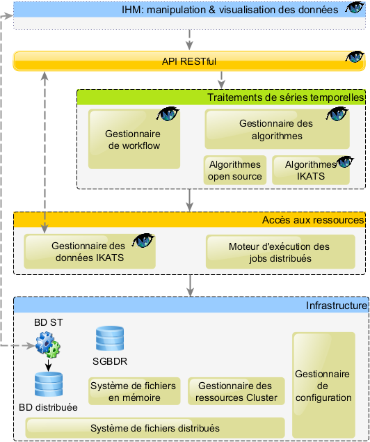

Overview
=========

This page introduces an overview of the IKATS architecture

General Architecture
--------

Hereunder is the global organisation of IKATS and its environment.

Big data infrastructure
-------
IKATs can be installed on a standalone PC but it is more efficient on a Hadoop infrastructure

Database management
--------
Data is composed of TimeSeries , stored in OpenTSDB, and different data types stored in POstgreSQL

OpenTSDB has been chosen for its high capabilities to deal with timeseries data.

There are some limits in this choice : a timestamp must not be more precise than milliseconds, and time stamp must be later than 01-01-1970.

OpenTSDB introduces the following constraint on a time series data :
In OpenTSDB, a time series data point consists of:

- A metric name.
- A UNIX timestamp (seconds or milliseconds since [Epoch](http://en.wikipedia.org/wiki/Unix_epoch).
- A value (64 bit integer or [single-precision floating point](http://opentsdb.net/docs/build/html/user_guide/writing.html) value)
- A JSON formatted event or a histogram/digest.
- A set of tags (key-value pairs) that describe the time series the point belongs to.
